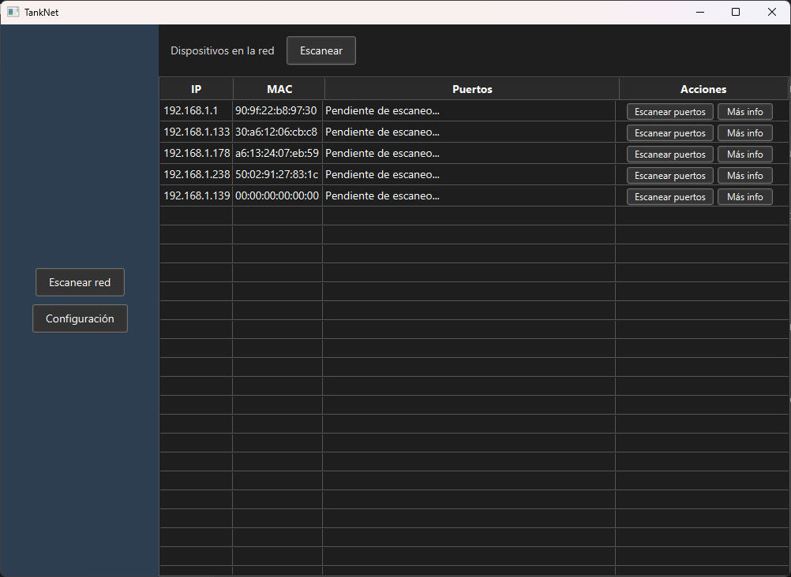
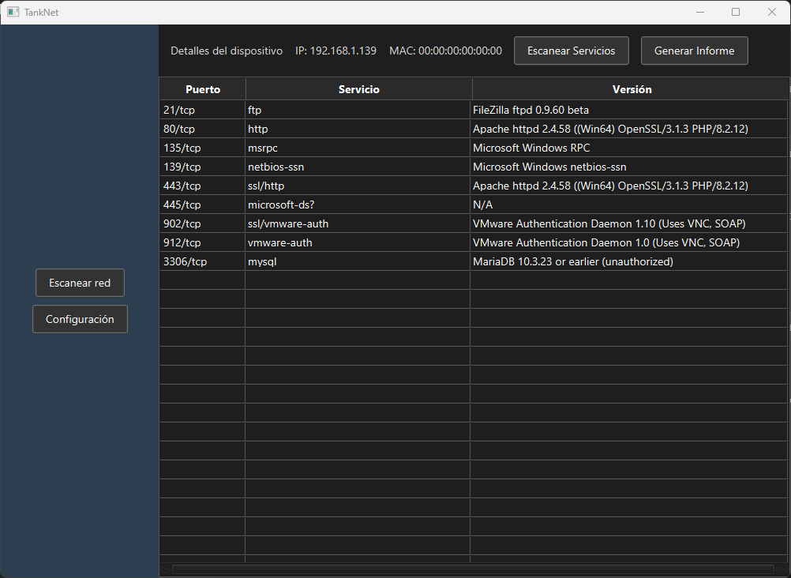
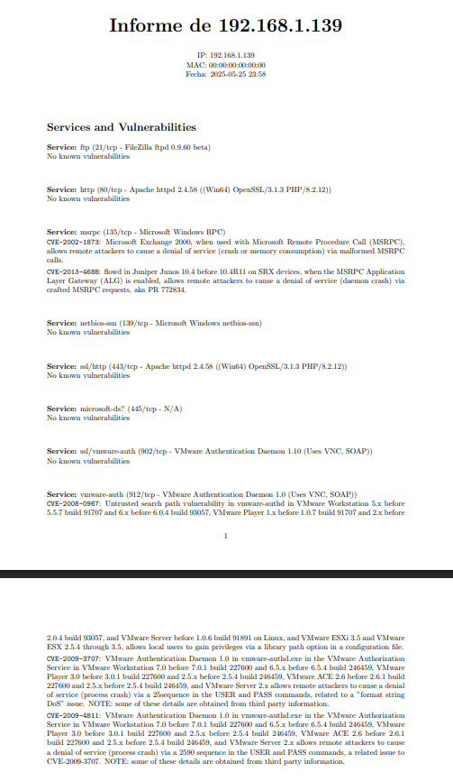

# 🛡️ TankNet - Auditoría de redes local automatizada

**TankNet** es una aplicación de escritorio desarrollada en JavaFX que permite analizar dispositivos conectados en la red local, escanear puertos, detectar servicios y generar informes detallados en PDF con posibles vulnerabilidades extraídas en tiempo real desde la [National Vulnerability Database (NVD)](https://nvd.nist.gov/).

---

## ✨ Características

- 🔍 **Descubrimiento de dispositivos** en todas las subredes activas
- 🌐 **Escaneo de puertos** abiertos usando `nmap`
- 🧠 **Detección de servicios y versiones** activas en cada dispositivo
- 🚨 **Consulta automática de vulnerabilidades (CVEs)** por servicio y versión
- 📄 **Generación de informes PDF profesionales** con LaTeX
- 🌙 **Modo oscuro / claro**
- 🗃️ **Configuración persistente** en JSON

---

## 🖼️ Capturas

| Escaneo de red         | Servicios y vulnerabilidades | Informe generado |
|------------------------|------------------------------|------------------|
|  |  |  |

---

## ⚙️ Requisitos

- Java 17 o superior
- [Nmap](https://nmap.org/) instalado y accesible desde la terminal
- [pdflatex](https://miktex.org/) (MiKTeX, TeX Live...) para generar informes en PDF
- Sistema operativo compatible: Windows, Linux

---
Abre el proyecto directamente con **IntelliJ IDEA** o tu IDE Java favorito.

---

## 🧪 Uso

1. Ejecuta la aplicación
2. Pulsa **"Escanear red"** para descubrir dispositivos conectados
3. Haz clic en **"Escanear puertos"** en cualquier dispositivo para detectar servicios
4. Pulsa **"Más info"** para ver detalles y generar un informe en PDF

---

## 📄 Informe generado

Cada informe incluye:

- Dirección IP y MAC del dispositivo
- Servicios activos y sus versiones
- CVEs asociados (extraídos de la API oficial de la NVD)
- Fecha y hora del escaneo

> ⚠️ Las descripciones de las vulnerabilidades están en el idioma seleccionado (Traduccion automatica por DeepL).

---
## 📚 Tecnologías utilizadas

- Java 17
- JavaFX 21
- Nmap
- LaTeX (MiKTeX / TeX Live)
- JSON + Jackson
- API REST de la NVD

---

## 📌 Notas

- El programa **no requiere conexión a Internet**, excepto para consultar vulnerabilidades.
- Se han filtrado subredes de Docker, VirtualBox y localhost para evitar falsos positivos.

---

## 🧑‍💻 Autor

**Daniel Romero Ávila**  
Desarrollador y estudiante de ciberseguridad apasionado por automatización, hacking ético y crear herramientas útiles.

---
